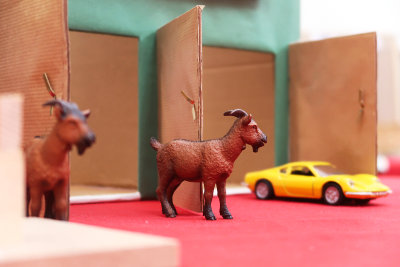
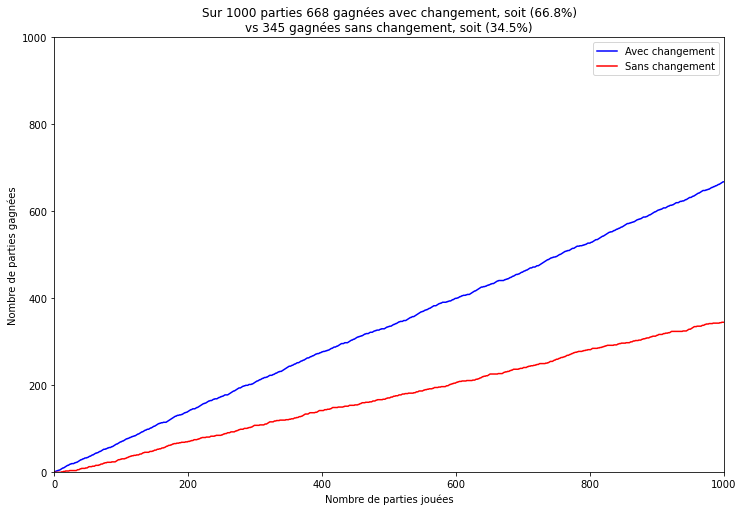

# Monty-Hall

Il s'agit de l'implémentaion du problème appelé Monty Hall en référence à l'animateur du jeu télévisé américain [Let's Make a Deal](https://fr.wikipedia.org/wiki/Let%27s_Make_a_Deal). L'énoncé est très simple, mais la solution est souvent considérée comme contre-intuitive.  

> « Supposez que vous êtes sur le plateau d'un jeu télévisé, face à trois portes et que vous devez choisir d'en ouvrir une seule, en sachant que derrière l'une d'elles se trouve une voiture et derrière les deux autres des chèvres. Vous choisissez une porte, disons la numéro 1, et le présentateur, qui sait, lui, ce qu'il y a derrière chaque porte, ouvre une autre porte, disons la numéro 3, porte qui une fois ouverte découvre une chèvre. Il vous demande alors : « désirez-vous ouvrir la porte numéro 2 ? ». Avez-vous intérêt à changer votre choix ? »

Il est nécessaire de compléter cet énoncé, pour éviter toute ambiguité par :
1. Le présentateur doit toujours ouvrir une porte  qui n'a pas été choisie par vous, derrière laquelle il y a une chèvre.
1. Le choix qui vous est offert est entre la porte choisie à l'origine et la porte fermée restante.

On peut se fier à son intuition ou faire des maths ou encore être un gros bourin d'informaticien. Pour cela il suffit de simuler une centaine de parties et regarder les résultats. Cela devrait permettre de définir la bonne stratégie ! Bon un raisonnement correct c'est bien aussi.

## Simulation

La simulation nous donne le résultat suivant :

On constate que la bonne stratégie consiste donc à changer de porte pour augmenter ses chances.

les pigeons nous appelle à un peu d'humilité. En effet, Herbranson et Schroeder ont montré en 2010 que les pigeons après une centaine de tentatives retenaient que la bonne stratégie consistait à changer[¹](#1).

 

1. HERBRANSON, Walter T. and SCHROEDER, Julia, 2010. Are birds smarter than mathematicians? Pigeons (Columba livia) perform optimally on a version of the Monty Hall Dilemma. *Journal of Comparative Psychology* [online]. 2010. Vol. 124, no. 1, p. 1–13. [Accessed 13 January 2022]. DOI [10/ds2rnn](10/ds2rnn). Available from: [10/ds2rnn](10/ds2rnn)[⏎](#a1) 

